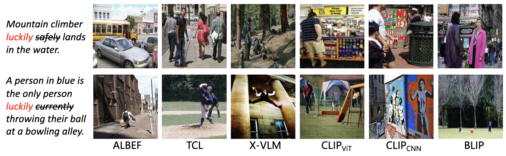

# One Perturbation is Enough: On Generating Universal Adversarial Perturbations against Vision-Language Pre-training Models
[ICCV 2025] A PyTorch official implementation for [One Perturbation is Enough: On Generating Universal Adversarial Perturbations against Vision-Language Pre-training Models](https://arxiv.org/abs/2406.05491).

[Hao Fang*](https://scholar.google.cz/citations?user=12237G0AAAAJ&hl=zh-CN),
[Jiawei Kong*](https://scholar.google.cz/citations?user=enfcklIAAAAJ&hl=zh-CN), 
[Wenbo Yu](https://scholar.google.cz/citations?user=ktJxMcgAAAAJ&hl=zh-CN),
[Bin Chen#](https://scholar.google.com/citations?user=Yl0wv7AAAAAJ&hl=zh-CN),
[Jiawei Li](https://scholar.google.com/citations?hl=zh-CN&user=AbdZUcIAAAAJ),
[Hao Wu](),
[Shu-Tao Xia](https://www.sigs.tsinghua.edu.cn/xst/main.htm),
[Ke Xu](https://www.insc.tsinghua.edu.cn/info/1157/2467.htm)


## Visualization
<!--  -->


## Setup
### Install dependencies
We provide the environment configuration file exported by Anaconda, which can help you build up conveniently.
```bash
conda env create -f environment.yml
conda activate CPGC
```  
### Prepare datasets and models

- Download the datasets, [Flickr30K](https://shannon.cs.illinois.edu/DenotationGraph/), [MSCOCO](https://cocodataset.org/#home), and fill the `image_root` in the configuration files.

- Download the checkpoints of the finetuned VLP models: [ALBEF](https://github.com/salesforce/ALBEF), [TCL](https://github.com/uta-smile/TCL), [CLIP](https://huggingface.co/openai/clip-vit-base-patch16), [BLIP](https://github.com/salesforce/BLIP), [X-VLM](https://github.com/zengyan-97/X-VLM)

## Running commands

### Training
Below we provide running commands for training the contrastive-training perturbation generator with Flickr30K as the training set and ALBEF as the surrogate model.


```python
python train.py --config configs/Retrieval_flickr_train.yaml --source_model ALBEF --source_ckpt $CKPT
```

[Download](https://drive.google.com/drive/folders/1XwSiBpdOgbtI0lyjEO6coq_fiObg-9P6?usp=sharing) the generators and UAPs.

### Testing

Below we provide running commands for testing our method in Image-Text Retrieval (ITR) task:

```python
python eval.py --config configs/Retrieval_flickr_test.yaml --source_model ALBEF  --load_dir $UAP_PATH
```

## Cite
```python
@article{fang2024one,
  title={One Perturbation is Enough: On Generating Universal Adversarial Perturbations against Vision-Language Pre-training Models},
  author={Fang, Hao and Kong, Jiawei and Yu, Wenbo and Chen, Bin and Li, Jiawei and Xia, Shutao and Xu, Ke},
  journal={arXiv preprint arXiv:2406.05491},
  year={2024}
}
```
